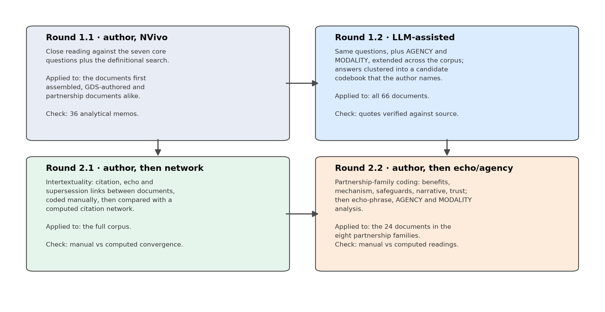
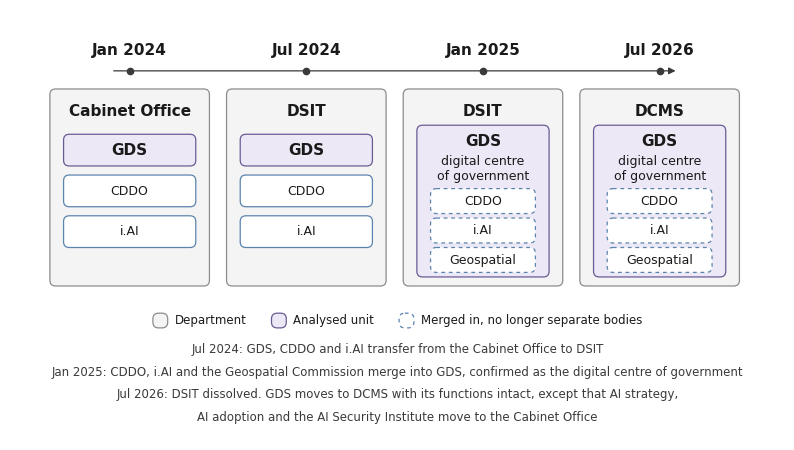
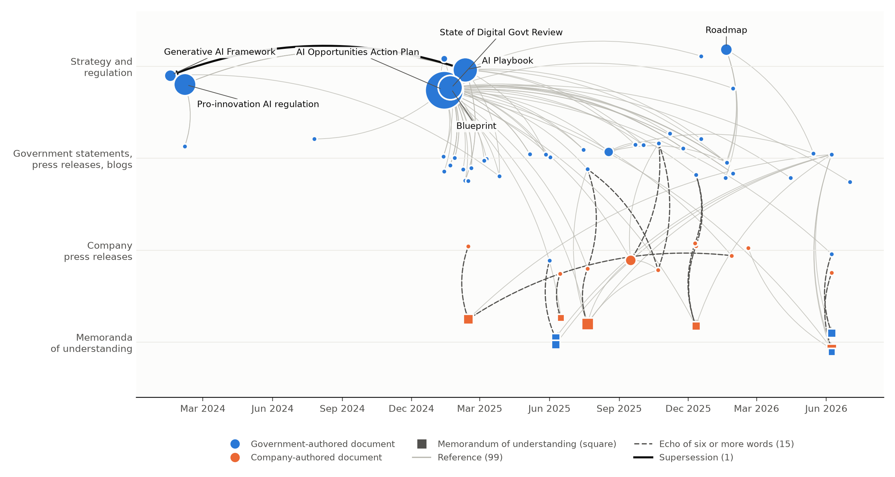
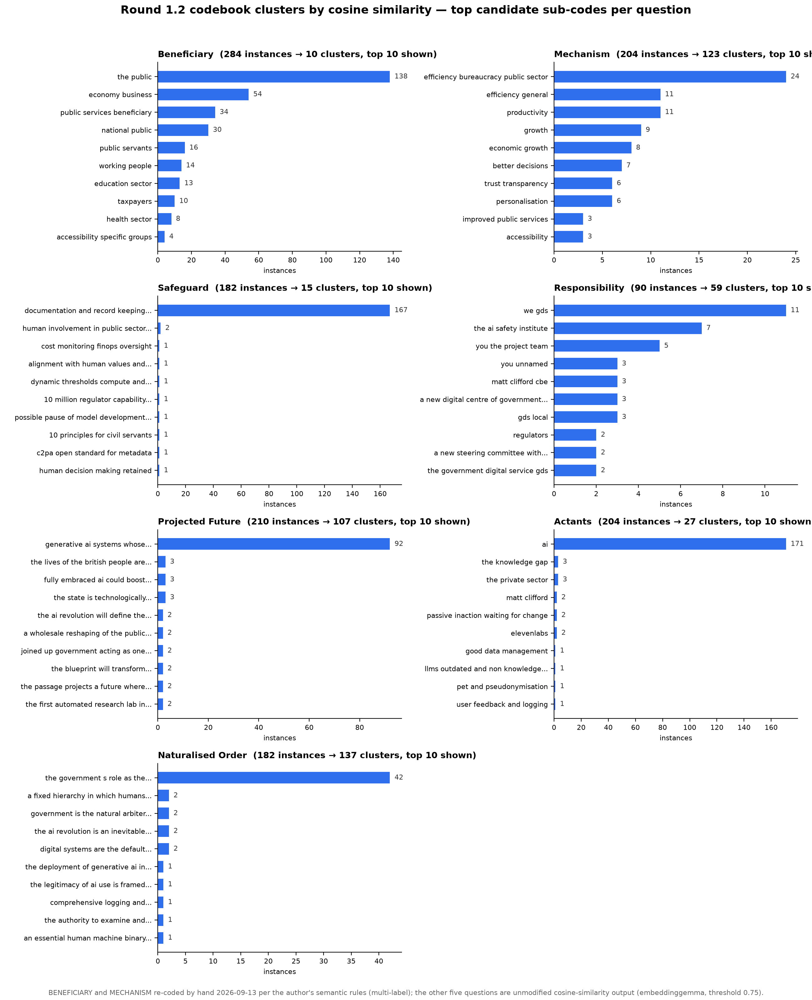

# Figures and interactive visuals

## Figures used in the dissertation

| | File | Where it appears |
|---|---|---|
|  | [`figures/figure1_coding_rounds.png`](figures/figure1_coding_rounds.png) | Figure 1: the four coding rounds, and which are the author's own NVivo coding versus pipeline-assisted |
|  | [`figures/figure2_gds_departments.png`](figures/figure2_gds_departments.png) | Figure 2: GDS and the departments it sat in, January 2024 to July 2026. Drawn by the author, not generated by a script |
|  | [`figures/figure3_intertextual_network.png`](figures/figure3_intertextual_network.png) | Figure 3: the intertextual network, drawn from [`analysis/networks/intertextual_v0.json`](../analysis/networks/intertextual_v0.json). An interactive version is below |
|  | [`figures/codebook_clusters_top_bars.png`](figures/codebook_clusters_top_bars.png) | Appendix H: the largest clusters in the candidate codebook, for each core question |

[`figures/make_figures.py`](figures/make_figures.py) generates Figures 1 and 3 from the files in
the repository (`analysis/networks/intertextual_v0.json`, `data/manifest.csv`); Figure 2 is the
author's own diagram, not code-generated. The script also draws a machinery-of-government timeline
that an earlier draft used in Figure 2's place; that image isn't in this repository, since the
dissertation no longer uses it, but the script that draws it is left as it ran, for the record.

## Interactive citation network

[`analysis/networks/authorship_family_map.html`](../analysis/networks/authorship_family_map.html)
is an interactive version of Figure 3: the same 66 nodes and 115 links, filterable and searchable,
built from the same `intertextual_v0.json`. Open it locally, or, once this repository is public and
[GitHub Pages](https://pages.github.com) is turned on for it, at
`https://valeriatafoyadv.github.io/uk-ai-public-good-discourse/analysis/networks/authorship_family_map.html`.

## Appendix: query and echo-phrase charts

Two more interactive pages sit alongside the network map, both built by the pipeline and not
redrawn for the dissertation as static figures:

| Page | What it shows | Built by |
|---|---|---|
| [`analysis/queries/queries.html`](../analysis/queries/queries.html) | Phrase status by genre and by GDS tier, and AGENCY by genre (Table 9) | `scripts/07b_queries.py`, `scripts/11_agency_query.py` |
| [`analysis/queries/echo_summary.html`](../analysis/queries/echo_summary.html) | The 51 echo phrases, grouped by partnership family | `scripts/07_echo.py` |

Once GitHub Pages is on, these are also reachable directly:
`.../analysis/queries/queries.html` and `.../analysis/queries/echo_summary.html`.
